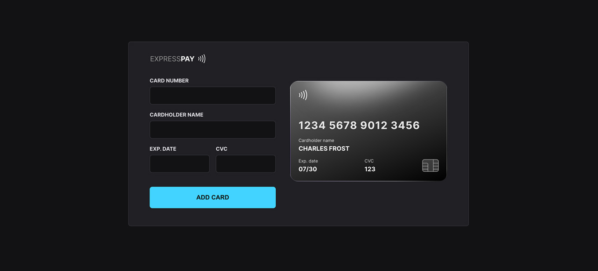

<h1 align="center">
  
</h1>

<h4 align="center">
  Convenient credit card payment options
</h4>

<p align="center">
  

  

  <a href="https://www.linkedin.com/in/viniciumedeiros/">
    
  </a>

  <a href="https://github.com/viniciumedeiros/gocast/commits/master">
    
  </a>

  
   <a href="https://github.com/viniciumedeiros/expresspay/stargazers">
    
  </a>
</p>

<p align="center">
  <a href="http://expresspay.vercel.app/">Live Preview</a>&nbsp;&nbsp;&nbsp;|&nbsp;&nbsp;&nbsp;
  <a href="#-project">Project</a>&nbsp;&nbsp;&nbsp;|&nbsp;&nbsp;&nbsp;
  <a href="#-technologies">Technologies</a>&nbsp;&nbsp;&nbsp;|&nbsp;&nbsp;&nbsp;
  <a href="#-how-to-use">How to use</a>&nbsp;&nbsp;&nbsp;|&nbsp;&nbsp;&nbsp;
  <a href="#-how-to-contribute">How to contribute</a>&nbsp;&nbsp;&nbsp;|&nbsp;&nbsp;&nbsp;
  <a href="#-license">License</a>
</p>



## 💻 Project

Expresspay is a component that simulates the credit card filling form, where it is possible to add masks to inputs and update HTML elements via DOM.
</br></br>
> [!NOTE]
> **Customizable cards available to help meet your requirements**
- [x] 💳 Amex: 341 [Gold]... 342 [Gold Rose]... 343 [Blue]... 344 [Green]... 37 [Platinum]
- [x] 💳 Visa: 44...
- [x] 💳 Mastercard: 55...
- [x] 💳 Discover: 65...
- [x] 💳 Dinner: 302...
- [x] 💳 JCB: 35..
- [x] 💳 Elo: 627780...
- [x] 💳 Maestro: 56...
- [x] 💳 Hipercard: 606282...

## 🚀 Technologies

This project was developed with the following technologies:

- HTML and CSS
- JavaScript and JSON
- [Node][node]
- [Yarn][yarn]
- [Vite][vite]
- [iMask][imask]

## 🌍 How To Use

To clone and run this application, you'll need [Git][git], [Node][node] + [Yarn][yarn] installed on your computer.

From your command line:

### Install Expresspay

```bash
# Clone this repository
$ git clone https://github.com/viniciumedeiros/expresspay

# Go into the repository
$ cd expresspay/

# Install dependencies
$ yarn

# Run the web server
$ yarn dev

# running
http://localhost:5173/
```

## 👽 How to contribute

-  Make a fork;
-  Create a branch with your feature: `git checkout -b my-feature`;
-  Commit changes: `git commit -m 'feat: My new feature'`;
-  Make a push to your branch: `git push origin my-feature`.

After merging your receipt request to done, you can delete a branch from yours.

## 📝 License

This project is under the MIT license. See the [LICENSE][license] for details.

---

🎓 Made with by Vinícius Medeiros 👨🏻‍💻 [Get in touch!][linkedin]

[vite]: https://vitejs.dev/
[imask]: https://imask.js.org/
[node]: https://nodejs.org/
[yarn]: https://yarnpkg.com/
[git]: https://git-scm.com
[license]: https://github.com/viniciumedeiros/expresspay/blob/master/LICENSE
[linkedin]: https://www.linkedin.com/in/viniciumedeiros/